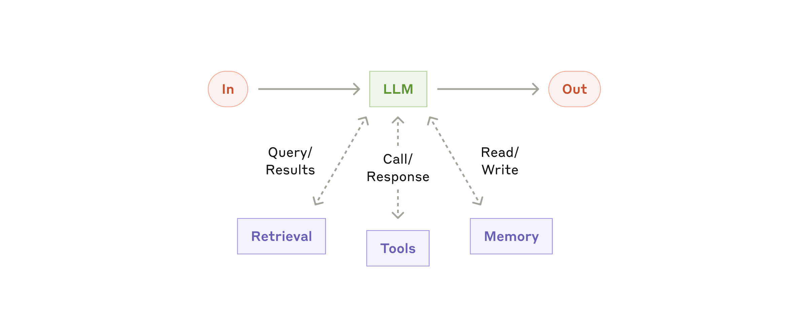
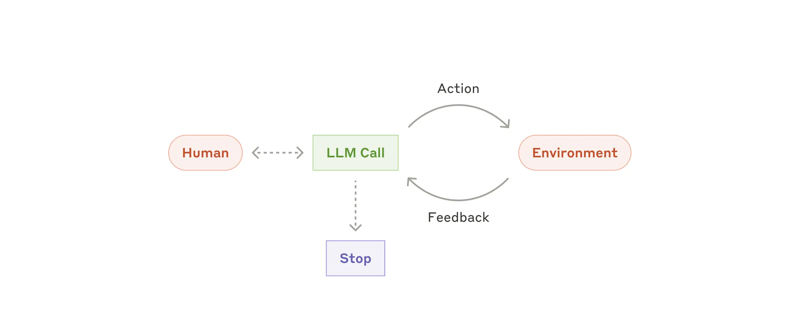

# Intro to Agentic AI

---

# Session Overview

- Agentic AI
  - Brief timeline of LLMs
  - Augmenting LLMs: AI Scaffolding
- (Exercise) Making your own AI Agent

---

# Agentic AI

---

# Agentic AI

# Brief timeline of LLMs

<!-- pause -->

## Artificial Intelligence (AI)

> Computers reproducing human intelligence

<!-- pause -->

## Machine Learning

> (A lot of) Data -> training models

- Simple: Logistic regression, Decision trees
- Complex: Neural networks, Ensembles of models ("Deep learning")

<!-- pause -->

## Generative AI

> AI designed to make _something new_, based on learning patterns from training data

- Markov chain: Predictive text
- Neural Networks: "Modern" image, audio, text generation
  - Transformer: Neural network architecture

<!-- pause -->

## LLMs

> Large Language Models. Process and generate natural language.

- GPT: Generative Pre-trained Transformer
- Making these models _huge_ caused them to exhibit "intelligence"

---

# Agentic AI

What if we gave an LLM the ability to interact with _things_? (and trained it to do so)

<!-- pause -->

# AI Scaffolding

> Software architecture and tooling built around a large language model to help it perform complex, goal-driven tasks.

<!-- pause -->

## Memory

- Long term memory
- System / skill prompts
- Reasoning and chain-of-thought

<!-- pause -->

## Retrieval

- Databases
- Web searches

<!-- pause -->

## (Other) Tools

- Calculators, code / syntax parsing
- Model Context Protocol (MCP) servers
- CLI tools

---

# Agentic AI

# AI Scaffolding

## Augmented LLM



> Source: [Anthropic](https://www.anthropic.com/engineering/building-effective-agents)

---

# Agentic AI

# AI Scaffolding

## Agent

> A system that achieves a task through directing its own process and tool usage and reacting to environmental feedback.

- ChatGPT / Claude Chat
- Claude Code / Cursor

```text
❯ How much bigger is London than Manchester? Make sure you get up-to-date population data.

◐ I need to find up-to-date population data for London and Manchester…

● Web Search: Find the most up-to-date official population estimates for…
  └ {"type":"output_text","text":{"value":"The most up-to-date offi…
…
```

---

# Agentic AI

# AI Scaffolding

## Agent



> Source: [Anthropic](https://www.anthropic.com/engineering/building-effective-agents)

---

# (Exercise) Making your own AI Agent

---

# Recap

# Agentic AI

<!-- pause -->

## Brief timeline of LLMs

How LLMs fit in with broader AI / ML concepts.

<!-- pause -->

## AI Scaffolding

LLMs can be augmented with memory, retrieval, tools.

Agents - Augmented LLMs running in a loop

<!-- pause -->

# (Exercise) Making your own AI Agent

- Claude API to call LLM
- Augmented with scaffolding
- Basic tool use

---

# Recap

---

# Further reading
